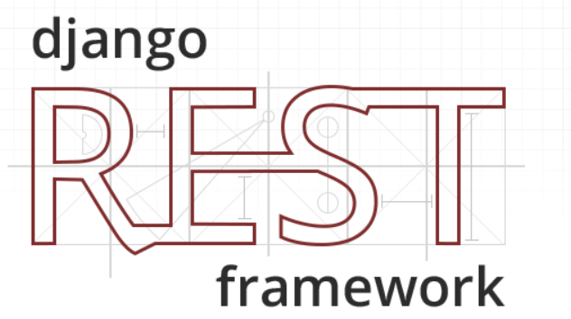

# Recipe API project


This is the sample project that I have self-learned and reference other to build an app back-end REST API, create recipe foodie cooking, the technologies are use:
- Python
- Django(3.2)
- Django REST Framework(3.12)
- Docker
- GitHub Actions
- PostgreSQL
- Test Driven Development.

## Prerequisite
You must have account ***github*** and ***docker-hub***.
## Getting started and run the project

To start project, you can run:
```sh
docker-compose up
```
So, the API will then be available at http://127.0.0.1:8000

## To use the swagger API:
To use swagger-API UI at http://127.0.0.1:8000/api/docs/